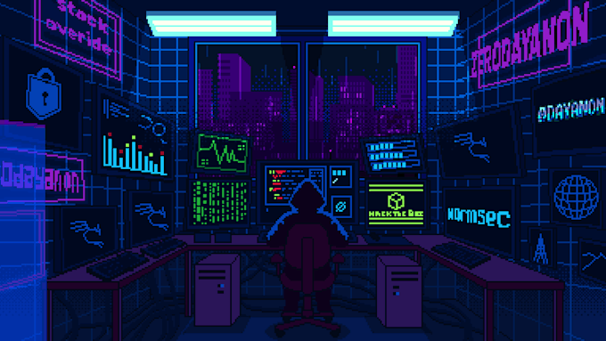
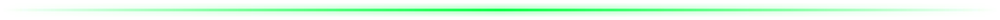

  
  
  
  
  

# Jeff Tong

I am a software developer with interests in `cybersecurity` and `machine learning`.  This markdown is the content used for [About Me](https://jeff-tong.dev/about_me.html).

## Currently
* **Senior Software Development Engineer** @ [CVS Health](https://www.cvshealth.com) — Re-architecting front-end and backend services.
* **Senior Software Engineer** @ [SquidSec](https://squidhacker.com/squidsec-team/) — security research and tool development.
* **Principal Software Development Engineer / CTO** @ [UglyEgg.AI](https://www.uglyegg.ai) — full stack development of Generative Search Optimization.

## Tech Skills

**Scripting**
 
  

**Programming Languages**
 
         

**Frontend**
 
    

**Backend**
 
    

**Data**
 
        

**Cloud & DevOps**
 
      

**Agentic Harnesses**
 
     

**Open Weight Models**
 
      

**AI Tooling**
 
    

**Projects**
* [Code Chronicles](https://dev.hashnode.dev) — Personal blog focused on InfoSec and software engineering.
* [PathFinder](https://github.com/wind010/PathFinder) — Automated cybersecurity reconnaissance tool.
* [OWASP Wrong Secrets](https://github.com/OWASP/wrongsecrets) — Contributed fix for a challenge issue.
* [Navi](https://github.com/denisidoro/navi) — Contributed improvements for better Windows support.
* [Snips.sh](https://github.com/robherley/snips.sh) - Reporting and fixing security issues.

## Hacking / CTF

  

* CTFs: [github.com/Wind010/ctfs](https://github.com/Wind010/ctfs)
* Bug bounty & vuln disclosures: `Log4Shell`, `IDOR`, `Broken Access Controls`, `Sensitive Information Disclosure`

**Skills**
 
      

**Tools**
 
         

**Interests**
 
   

## GitHub Analytics

