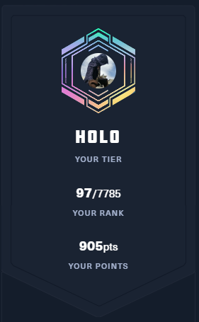

<link rel="stylesheet" href="readme.css">

# Jeff Tong

I am a software developer with interests in `cybersecurity` and `machine learning`.  This markdown is the content used for [About Me](https://wind010.github.io/Wind010/).


## Family
Private


## Education
Bachelor of Science in Physics with Mathematics minor from [Western Washington University](https://www.wwu.edu/).

Intended to double major in CS, but ultimately dropped it.

* MCPS: Microsoft Certified Professional
* MCSA1: Windows 2000
* MCSA1: Secrity on Windows 2000
* MCSE1: Windows 2000
* MCSE1: Security on Windows 2000


## Employment
TODO


## Interests
In my spare time, I train in martial arts, hacking/cybersecurity/reverse engineering, machine learning, coding, blogging, Cosplay/Conventions and hanging with friends and play video games.

* Electronics, mechanical keyboards, computer hardware, game development, graphics/shaders, comedy/humor.


### Blogging
I document things so I don't forget.  Might be helpful for others.
* [Code Chronicles](https://wind010.hashnode.dev)


### Martial Arts
I'm in it for the applications and exercise.

| Martial Art | Rank | Years of Experience |
| --- | --- | --- |
| [Hung Gar Kuen](https://en.wikipedia.org/wiki/Hung_Ga) | Level 4 | 20+ years |
| [Yang Style Tai Chi Chuan](https://en.wikipedia.org/wiki/Tai_chi) |  | 6 years |
| [Tae Kwon Do](https://en.wikipedia.org/wiki/Taekwondo) | Black Belt | 2 years |
| [Wing Chun](https://en.wikipedia.org/wiki/Wing_Chun) | SuiLumTao |  | 2 years |
| [Hapkido](https://en.wikipedia.org/wiki/Hapkido) | Second Dan | 3 years |
| [Kyokushin Karate](https://en.wikipedia.org/wiki/Kyokushin) | Unranked | 15+ years |


Dabbled in [Baguazhang](https://en.wikipedia.org/wiki/Baguazhang) and [Xing-I/Hsing-I Quan](https://en.wikipedia.org/wiki/Xingyiquan).  Would like to gain experience in [Shuai jiao](https://en.wikipedia.org/wiki/Shuai_jiao), [Judo](https://en.wikipedia.org/wiki/Judo), [Brazilian Jiu-Jitsu](https://en.wikipedia.org/wiki/Brazilian_jiu-jitsu).


<iframe width="640" height="480" src="https://youtu.be/P1VU82yn8SQ?t=66" title="Kyokushin Regional" frameborder="0" allow="accelerometer; autoplay; clipboard-write; encrypted-media; gyroscope; picture-in-picture; web-share" referrerpolicy="strict-origin-when-cross-origin" allowfullscreen></iframe>


* [Tournaments](https://www.youtube.com/watch?v=P1VU82yn8SQ)
* [Techniques](https://youtube.com/playlist?list=PLj6cjfP7PspidgyUIi1P6OFQZj7PpqmUN)

### Shows
 * Sci-Fi and Fantasy
    * Star Trek
    * Star Wars
    * The Expanse
    * Westworld
    * Game of Thrones/House of the Dragon


### Video Games
* Currently trying to finish `Baldur's Gate 3`.
* Elden Ring/Seikiro/Witcher 3/Fallout
* Counter Strike 2/Apex Legends
* Dota 2/League of Legends


### Electronics
I dabble in electronics.


### Hacking

I like participating in `Capture-The-Flags` (CTFs), CyberRanges, and Bug Bounties.




CTFs for the team:
* https://github.com/Wind010/ctfs

Contributions back to the community:
* https://github.com/OWASP/wrongsecrets/pull/1280
* https://github.com/aelmokhtar/CVE-2024-34716/pull/1
* https://github.com/Wind010/SolarPuttyDecryptor
* https://github.com/Wind010/rsa_small_exponent_exploit

Fun:
* https://wind010.github.io/ctf_soundboard/
* https://pages.scm.starbucks.com/jtong/stars-for-one/


Relevant Blog Articles:
* https://wind010.hashnode.dev/def-con-31
* https://wind010.hashnode.dev/hack-the-box-machine-tips
* https://wind010.hashnode.dev/capture-the-flags
* https://wind010.hashnode.dev/transformation
* https://wind010.hashnode.dev/hack-the-box-cubemadness1
* https://wind010.hashnode.dev/reverse-engineering-practice
* https://wind010.hashnode.dev/cracking-zip-and-rar-archives-with-passwords
* https://wind010.hashnode.dev/pwnagotchi-learnings-2023


#### Bug Bounties
Reporting on found vulnerabilities such as `Log4Shell`, `IDOR`, `Broken Access Controls`, and `Sensitive Information Disclosure`.
 * https://wind010.hashnode.dev/sensitive-data-exposure-and-vulnerability-reporting
 * https://wind010.hashnode.dev/log4shell


### Coding
Coding projects outside of work that are public on my github.  Participation in `Starbucks Six-Hack` weeks:

* [Simplified Returns](https://scm.starbucks.com/six-hack/internal_brew_gpt)
* [Internal BrewGpt](https://scm.starbucks.com/six-hack/internal_brew_gpt)
* [Brew Vision](https://scm.starbucks.com/six-hack/brew-vision)
* [Coffee ShopS imulator](https://scm.starbucks.com/jtong/CoffeeShop)


Coding Signal, LeetCode, Code, CodeWars


### Machine Learning
Specifically around computer vision, chatbots, LLMs, image/video generation, voice cloning.

Image enhancement:


Computer Vision:


Contributions back to the community:
* https://github.com/PromtEngineer/localGPT/pull/204

Relevant Blog Articles:
* https://wind010.hashnode.dev/restore-and-enhance-images
* https://wind010.hashnode.dev/real-time-deep-fakes
* https://wind010.hashnode.dev/audio-deep-fakes


### Podcasts
I listen to a lot of podcasts while multitasking.

<div class="grid-container">
    <div class="grid-item"><a href="https://www.preposterousuniverse.com/podcast/" target="_blank">
            
        </a></div>
    <div class="grid-item"><a href="https://lexfridman.com/podcast/" target="_blank">
            
        </a></div>
    <div class="grid-item"><a href="https://www.hubermanlab.com/podcast" target="_blank">
            
        </a>
    </div>
    <div class="grid-item"><a href="https://www.guyraz.com/howibuiltthisbook" target="_blank">
            
        </a>
    </div>
    <div class="grid-item"><a href="https://stuffyoushouldknow.com/" target="_blank">
            
        </a>
    </div>
    <div class="grid-item"><a href="https://www.iheart.com/podcast/105-stuff-they-dont-want-you-t-26941221/"
            target="_blank">
            
        </a></div>
    <div class="grid-item"><a href="https://www.dancarlin.com/hardcore-history-series/" target="_blank">
            
        </a></div>
    <div class="grid-item"><a href="https://astonishinglegends.com/" target="_blank">
            
        </a></div>
    <div class="grid-item"><a href="https://allin.com/" target="_blank">
            
        </a></div>
</div>

</br>


### Cosplay
I dabble in Cosplay.


### Humor
I enjoy making `memes` and leaving `Easter Eggs` in code comments that attempt to make people laugh.


```sh
...
```


#### Easter Comments Eggs
* TODO
